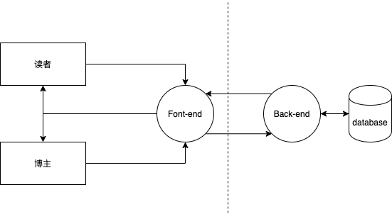

### 1. 以本次课程提到的这个博客网站为案例，画出一份数据流图。

### 2. 基于画出来的数据流图，请结合STRIDE模型识别出这个博客网站可能面临的5个威胁。
- Spoofing，欺骗  ---博主登陆了假网站，暴露了自己用户名密码
- Tampering，篡改 --- 读者通过评论进行了sql注入
- Repudiation，否认、抵赖 --- 博主误操作将博客全部删除还不承认
- Information disclosure，信息泄露 
- Deny of service，拒绝服务  --- 黑客发起DOS
- Elevation of privilege，特权提升 --- 非登陆用户通过某种方式获得登陆用户权限

### 3. 对上一个问题中识别出来的5个威胁，请结合DREAD对其进行风险评估。
Damage potential，潜在损失
Reproducibility，重现性
Exploitability，利用难度
Affected users，受影响用户数量
Discoverability，是否容易被发现

|   | D  | R  | E  | A  | D  | TOTAL| 
|---|---|---|---|---|---|---|
| 博主登陆了假网站，暴露了自己用户名密码  | 3  | 1  | 1  | 1  | 1  | 7  |
| 读者通过评论进行了sql注入  | 3  | 3  | 2  | 3  | 2  | 13  |
| 博主误操作将博客全部删除还不承认  | 3  | 1  | 1  | 1  | 1  | 7  |
| 黑客发起DOS  | 2  | 3  | 3  | 3  | 3  | 14 |  
| 非登陆用户通过某种方式获得登陆用户权限  | 1  | 3  | 1  | 1  | 1  | 7  |
