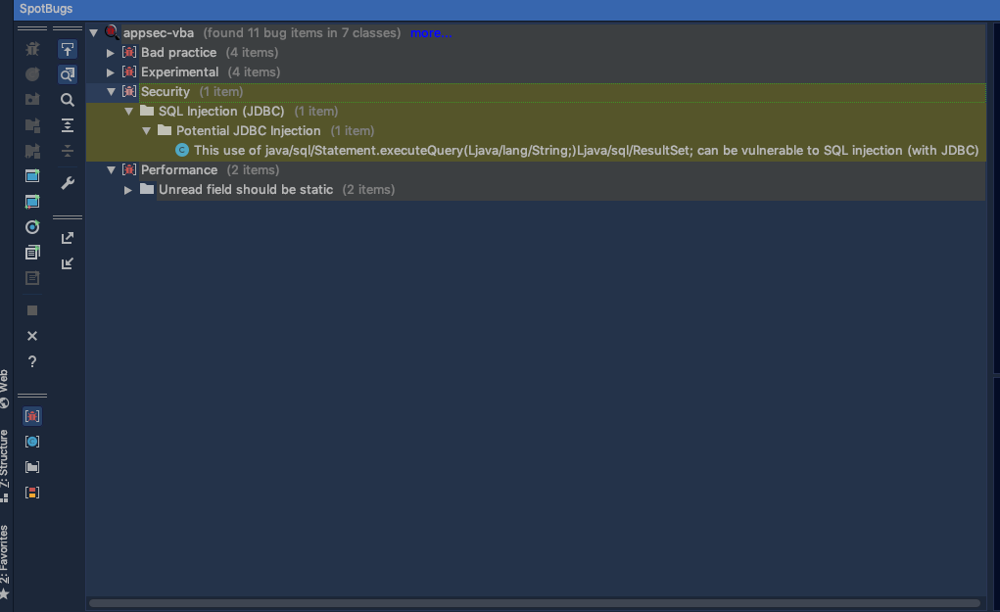
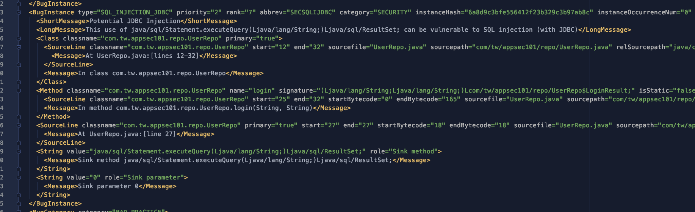

## 安装Find-Sec-Bugs IDE插件，并在本地运行该插件，让其进行源码安全扫描。请将工具找到的安全问题截图。可使用这个含有安全漏洞的代码仓库。

1. Install the `spotBugs` IDE plugIn Tool
2. Add the Find `securityBugs` plugins to `spotBugs`
3. run the scan
## 安装Spot Bugs及Find-Sec-Bugs插件，以本地构建集成的方式运行源码安全扫描。请将工具找到的安全问题截图。可使用这个含有安全漏洞的代码仓库。

1. add the dependency 
  ```
plugins {
    id "com.github.spotbugs" version "4.3.0" 
}

dependencies {
    spotbugsPlugins 'com.h3xstream.findsecbugs:findsecbugs-plugin:1.10.1' 
}
  ```
2. run `./gradlew spotbugsMain`
## 在本地搭建SonarQube服务器，安装FindBugs SonarQube插件，并利用SonarQube对源码进行一次源码安全扫描。请将SonarQube找到的安全漏洞列表截图。可使用这个含有安全漏洞的代码仓库。
1. create a docker-compose
2. 
