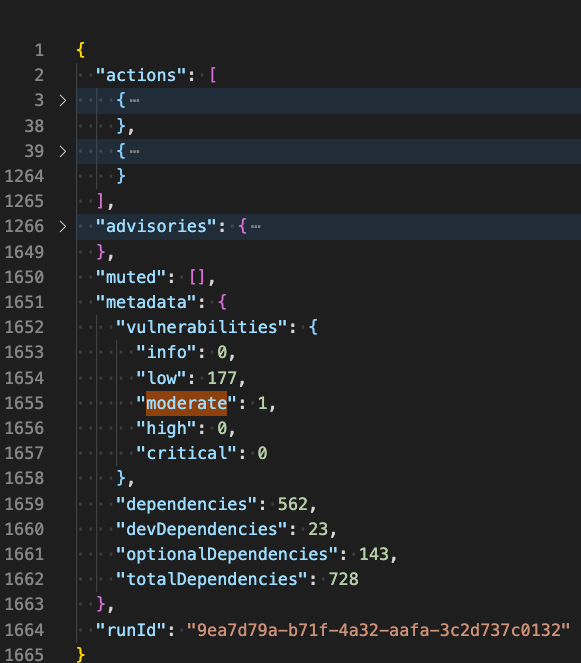
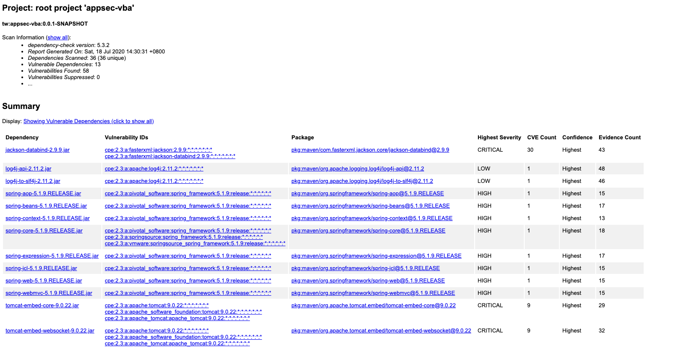

## 1.使用NPM Audit命令对一个前端应用进行依赖安全检查，并将扫描结果截图。可以使用这个含有漏洞的前端代码仓库(https://github.com/wmaintw/appsec101-vfa.git)。
1. npm audit (--only=prod/--json)

## 2.使用OWASP DependencyCheck对Java或.Net应用的依赖进行安全扫描，并将扫描结果（扫描报告）截图。可以使用这个含有漏洞的后端代码仓库(https://github.com/wmaintw/appsec101-vba.git)。
1. 添加插件
```
 plugins {
    id "org.owasp.dependencycheck" version "5.3.2.1"
}
```
2. `./gradlew dependencyCheckAnalyze --info`  or `./gradlew dependencyCheckAggregate --info`


## Note
依赖安全检查的基本原理就是对在漏洞数据库中查找和匹配依赖及其版本号
