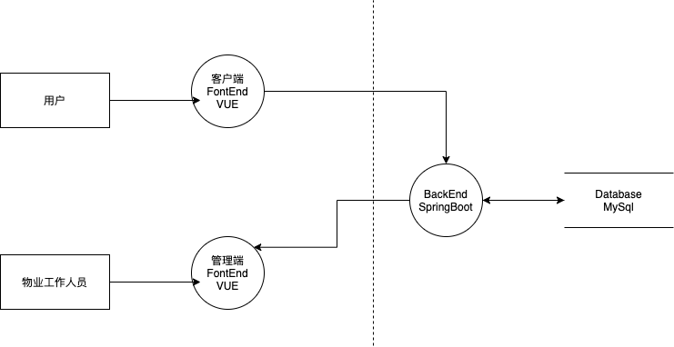

## 请阅读下面这个业务场景，并对其进行一次威胁建模。请使用STRIDE的方式来识别威胁，用DREAD模型对识别出来的威胁进行风险评估。请提交以下作业：

1. 这个系统的数据流图（DFD）
 
2. 至少5个威胁 
- 由于不需要登陆，可以通过脚本短时间内恶意填写大量无用数据
- 在留言的文本进行SQL注入
- DOS攻击
- 下载excel中可能包含pii，容易丢失泄露
- 管理员登陆账户被盗，留言信息被泄漏
3. 这5个威胁对应的DREAD评分及总分、风险等级 。

|   | D  | R  | E  | A  | D  | TOTAL| 等级 |
|---|---|---|---|---|---|---|---|
| 由于不需要登陆，可以通过脚本短时间内恶意填写大量无用数据 | 2  | 3  | 3  | 1  | 3  | 12  |高|
| 在留言的文本进行SQL注入  | 3  | 3  | 2  | 3  | 2  | 13  |高|
| DOS攻击  | 2  | 3  | 3  | 3  | 3  | 14  |高|
| 下载excel中可能包含pii，容易丢失泄露  | 3  | 1  | 1  | 3  | 1  | 9 |  中|
| 管理员登陆账户被盗，留言信息被泄漏  | 3  | 1  | 1  | 3  | 2  | 10  |中|

 **业务上下文：软件园的物业管理中心构建了一个网上留言簿Web应用，希望能够通过这个应用收集大家对物业的反馈意见，用于持续改进物业服务水平。在客户端，这留言簿只有一个Web页面，无需用户登录就可以在这个页面上留下反馈意见。在管理端，物业工作人员可以通过另一个Web页面登录到留言簿系统，查看系统收集到的留言。同时，系统也允许物业工作人员把过去某一段时间内收到的留言导出成excel文件并下载。 技术上下文：前端用Vue.js做开发，后端用SpringBoot单体应用，服务器用MySQL。所有服务器均部署在阿里云上。客户端和管理端均可通过互联网访问。**
