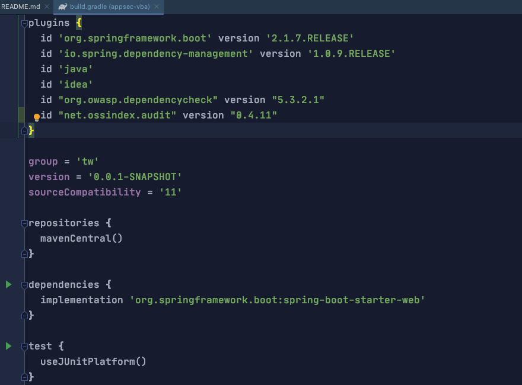
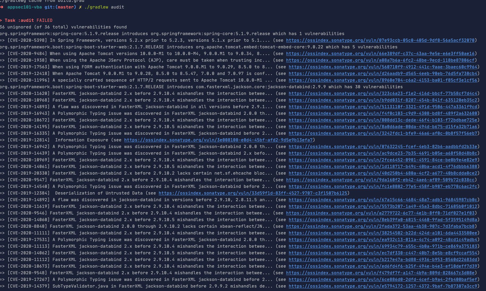

## OSSIndex是另一个检查依赖安全的工具，请以这个含有漏洞的代码仓库(https://github.com/wmaintw/appsec101-vba.git)为目标测试应用，用OSSIndex Gradle插件对其进行依赖安全检查。请分别提供以下2部分作业：
1. build.gradle文件中引入OSSIndex插件相关的源代码截图
- https://github.com/sonatype-nexus-community/ossindex-gradle-plugin
- 
2. OSSIndex实施扫描后的命令行输出结果的截图
- 
